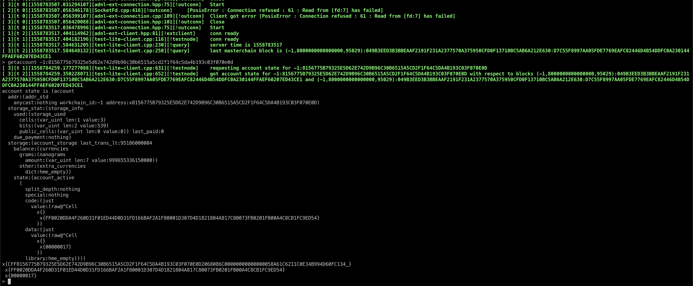

# TON Research

This open development community and **enthusiasts research place**. We will post our news and updates this project there.

---
## Table of contents:

<!-- toc -->

- [Quicklinks:](#quicklinks)
- [What we already did:](#what-we-already-did)
- [Future steps:](#future-steps)
  * [Creating FAQ & Video tutorial (WIP):](#creating-faq--video-tutorial-wip)
  * [Also, you will find there:](#also-you-will-find-there)
  * [Got questions?](#got-questions)
- [Installation & Setup](#installation--setup)
  * [Releases (macOS) 🏗](#releases-macos-%F0%9F%8F%97)
- [Project](#project)
- [Contributing](#contributing)
- [Contact us (Telegam):](#contact-us-telegam)

<!-- tocstop -->

## Quicklinks:

- [Telegram Open Network Whitepaper](https://github.com/copperbits/TON/blob/master/ton.pdf)
- [Telegram Open Network Virtual Machine](https://github.com/copperbits/TON/blob/master/tvm.pdf)
- [Telegram Open Network Blockchain](https://github.com/copperbits/TON/blob/master/tblkch.pdf)
- [Fift: A Brief Introduction](https://github.com/copperbits/TON/blob/master/fiftbase.pdf)


## What we already did:
- 🏗 Build lite client node: [First release](https://github.com/copperbits/TON/releases/tag/test-1)
- 🖥 Started Lite Client on macOS
- 📩 Sent transactions to TON network
- 🎓 Now we are writing tutorials / FAQ / HOWTO how to use TON.
- 👉 _any request and suggestions are [very welcome](https://github.com/copperbits/TON/issues/new)!_
- 🏗 Instructions for building lite client on [Ubuntu 16.04](docs/ubuntu16.04.sh)



## Future steps:

### Creating FAQ & Video tutorial (WIP):
_✨feel free to propose your topics_
- Step-by-step guide: **How to build a TON client**
- How to get test Grams
- Development:
  - Write first hello-world smart contract
  - How to deploy a smart contract
  - How to send transactions

### Also, you will find there:
- Future releases of binaries
- A FAQ with most popular questions (WIP)

### Got questions?
 If you have any quistions about project/installation - feel free to [open an issue!](https://github.com/copperbits/TON/issues/new)


## Installation & Setup

- Download [latest release](https://github.com/copperbits/TON/releases/)
- Go to command line, where binary placed
- Run:
```bash
./test-lite-client -C ton-lite-client-test1.config.json
```
- run `help` to get started

### Releases (macOS) 🏗

[Lite Client Latest release](https://github.com/copperbits/TON/releases/tag/test-1)

## Project

<!-- - View [CHANGELOG][] :notebook_with_decorative_cover: -->
- Bugs, suggestions or feature requests, [open an issue](https://github.com/copperbits/TON/issues/new) :octocat:
- Star [GitHub repo](https://github.com/copperbits/TON/) to support this project :+1:
- License in [GNU Lesser General Public License v2.1
](https://github.com/copperbits/TON/blob/master/LICENSE) :unlock:
- Shipped by [CooperBits team](https://t.me/copperbits) :sunny: and [contributors](https://github.com/copperbits/TON/graphs/contributors) :clap:

## Contributing

Your contributions are appreciated. You can follow [CONTRIBUTING](https://github.com/copperbits/TON/blob/master/CONTRIBUTING.md) guide to get everything started.

## Contact us (Telegam):
- [Telegam public group](https://t.me/copperbits)

---

Readme:
This is a distribution of a preliminary version of the TON Blockchain Lite Client along with the relevant portions of the TON Blockchain Library. It is not necessarily representative of the totality of the TON Blockchain code developed so far; rather it is a simplified stable version, containing only those files that are necessary for compiling the Lite Client, and sometimes outdated versions of these files sufficient for this purpose.

Use this software at your own risk; consult the DISCLAIMER for more information.

The software is licensed under GNU Lesser General Public License version 2 or later; consult LICENSE.LGPL and LGPL.v2 for more information. If you ever use any of these source files to develop your own versions of this or other software, you must attach a comment with the contents of LGPL.v2 to the beginning of each source file taken from this archive.

The software is likely to compile and work properly on most Linux systems. It should work on macOS and even Windows; however, we do not guarantee this for this preliminary version.

Basic compilation and installation instructions

1. Download and unpack the newest version of this archive, available at
https://test.ton.org/download
The TON Blockchain Test Network is updated quite often, so we cannot guarantee that older versions of the Lite Client will always work. Backward compatibility is not enforced at this development stage.

2. Install the newest versions of make, cmake (version 3.0.2 or later), OpenSSL (including C header files), and g++ or clang (or another C++14-compatible compiler as appropriate for your operating system).

3. Suppose that you have unpacked this archive to directory ~/lite-client, where ~ is your home directory, and that you have created an empty directory ~/liteclient-build. Then run the following in a terminal on a Linux system:

  ```bash
  cd ~/liteclient-build
  cmake ~/lite-client
  cmake --build . --target test-lite-client
  ```
You might also want to build some extra utilities useful for smart-contract development:

  ```bash
  cmake --build . --target fift
  ```

4. Download the newest configuration file from https://test.ton.org/ton-lite-client-test1.config.json :

  ```bash
  wget https://test.ton.org/ton-lite-client-test1.config.json```

5. Run the Lite Client:

  ```bash
  ./test-lite-client -C ton-lite-client-test1.config.json
  ```
If everything was installed successfully, the Lite Client will connect to a special server (a full node for the TON Blockchain Test Network #1) and will send some queries to the server.
If you indicate a writeable "database" directory as an extra argument to the client, it will download and save the block and the state corresponding to the newest masterchain block:

  ```bash
  ./test-lite-client -C ton-lite-client-test1.config.json -D ~/ton-db-dir
  ```
Basic help info can be obtained by typing "help" into the Lite Client. Type "quit" or press Ctrl-C to exit.

6. Now you can create new smart contracts, examine the state of existing smart contracts, send external messages to smart contracts and so on. You can also use Fift (if you have compiled it) to compile, execute, and debug your smart contracts locally.

  More details on these activities, including step-by-step instructions for creating a simple wallet smart contract (along with its source code), may be found in the HOWTO file included in this archive.

7. Some documentation on the TON Blockchain and TON Virtual Machine may be found at the download page https://test.ton.org/download . Be aware that this documentation may not be completely in sync with the version currently employed by the Test Network, because some minor implementation details are likely to be changed during the final development and testing phases.
